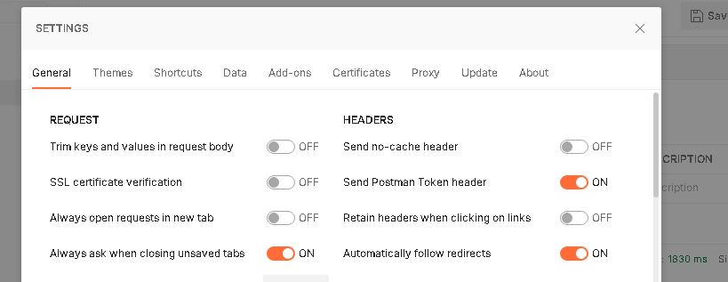
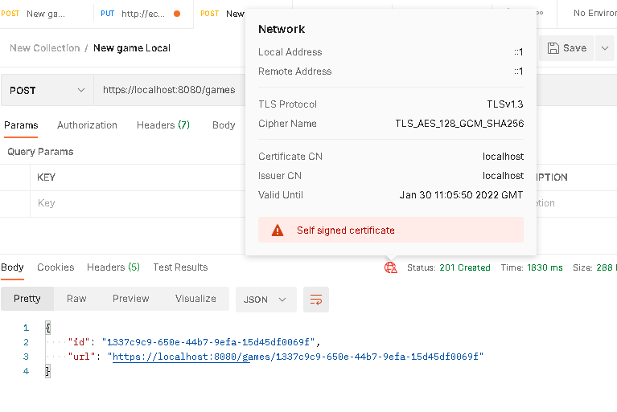
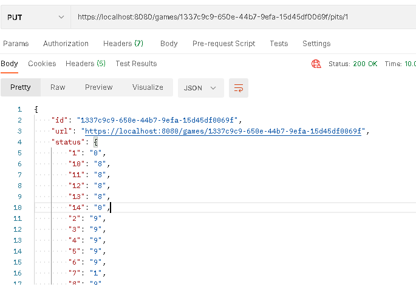

## Kalah Game - Backbase Assignment
This is Java8 SpringBoot RestFul Webservice that runs the "n" number of stones in pit.The number of stones can be configured in application.properties file.I have set number of stones to 6 for now.When the game starts it will load 6 stones by default in pits.This game runs on EC2 instance So,you can access this game from anywhere. 2 players can play the game from there PC.
This application can be started on https on local.If you want to enable https on local environment just enable the SSL properties in properties file.

### About the game
* Each of the two players has six pits in front of him/her. (Number of stones can be changed in properties file , if needed)
* To the right of the six pits, each player has a larger pit, his Kalah or house.
* At the start of the game, "n" stones are put In each pit.Where n stands for number of stones.In properties file we have set it to 6 for now.
* The player who begins picks up all the stones in any of their own pits, and distribute the stones on to the right, one in each of the following pits, including his own Kalah.
* No stones are put in the opponent(s) Kalah. If the players last stone lands in his own Kalah, he gets another turn. This can be repeated any number of times before it's the other player's turn.

### How to use this game
* Two human players to play the game, each in his own computer by accessing REST URIs.User needs to access AWS instance URL below.

1. Create a game using [curl --header "Content-Type: application/json" --request POST http://ec2-3-95-222-33.compute-1.amazonaws.com:8080/games] and returns game identifier and game url.
2. Using Game Identifier, navigate different pit [curl --header "Content-Type: application/json" --request PUT  http://ec2-3-95-222-33.compute-1.amazonaws.com:8080/games/{gameId}/pits/{pitId}] at the end of this action, result show about current status of the game by displaying Pit Id and it's stones count.

* Using Postman API Application (on Local machine)

If you have enabled SSL properties then application will be started with https. Before testing application on Postman you need to disable SSL verification.
Go to Setting --> SSL certificate verification.This is self signed certificate.
  
  

1.Select POST method from the dropdown and enter request URL _https://localhost:8080/games_. You will get game id and url of the game.

2. Copy the game url from response append "**/pits/{pit number}** to it. This will give response back with updated status of pits.

* Using Postman API Application to play on EC2 instance.
1. Just change the host name from localhost to EC2 host name. In this case its "**ec2-3-95-222-33.compute-1.amazonaws.com**".

*You can create and access the game by below urls.

   1. Method - POST   URL:  _http://ec2-3-95-222-33.compute-1.amazonaws.com:8080/games_
   2. Method - PUT    URL:  _http://ec2-3-95-222-33.compute-1.amazonaws.com:8080/games/6efedd0d-ef78-4867-9ebb-ae777d20c5a2/pits/{Pit_number}_

## Install & Running

##### 1) Open Git Bash. Go to the folder where you want to checkout the code.

cd git/

##### 2) Clone the code from git into the folder

git clone _https://github.com/m2garje/kalahagame.git_

##### 3) Go into the folder kalahagame

cd kalahagame

##### 4a) Start the application on local using maven

mvn spring-boot:run

#### 4b) Start the application on local using docker

docker image build -t kalahagame .

docker run -it kalahagame -p 8080:8080

##### 5) Call the API using curl

curl --header "Content-Type: application/json" --request PUT _http://localhost:8080/games/{gameId}/pits/{pitId}_

### Prerequisites
* [Java 1.8](http://www.oracle.com/technetwork/java/javase/downloads/index.html)  - Programming language
* [Spring Boot 2.4.2](https://spring.io/projects/spring-boot) - Application Boot Framework
* [Spring Framework 5+](https://spring.io/projects/spring-framework) - Spring Framework
* [Spring Hateoas](https://spring.io/projects/spring-hateoas) - Spring Hateoas
* [Maven](https://maven.apache.org/) - Build tool
* [Docker](https://docker.com/) - Build docker images
* [Junit](https://junit.org/junit5/) - Junit
* [AWS EC2 Instance](https://aws.amazon.com/ec2/instance-types/) - Instance for deployment

### API documentation
After running the project on dev/local environment and browse **http://localhost:8080/swagger-ui.html**

Access swagger running on EC2 instance : http://ec2-3-95-222-33.compute-1.amazonaws.com:8080/swagger-ui.html

###Future improvements

1.Introduce Spring Cloud ecosystem to manage multiple instances with Eureka service discovery,spring gateway,configuration management and circuit breaker for on premise.

2.Include security in the requests (using SSL/TLS) , now partially done for local PC.

3.Create GUI with the help of react or angular js to make it more interactive.

4.Introduce a persistence layer to store past game history.

5. Deploy applications in Kubernetes for high scalability and high availability.

##Author

Mahesh Garje

